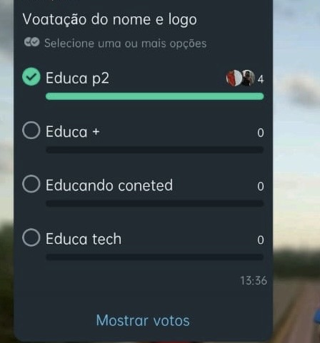
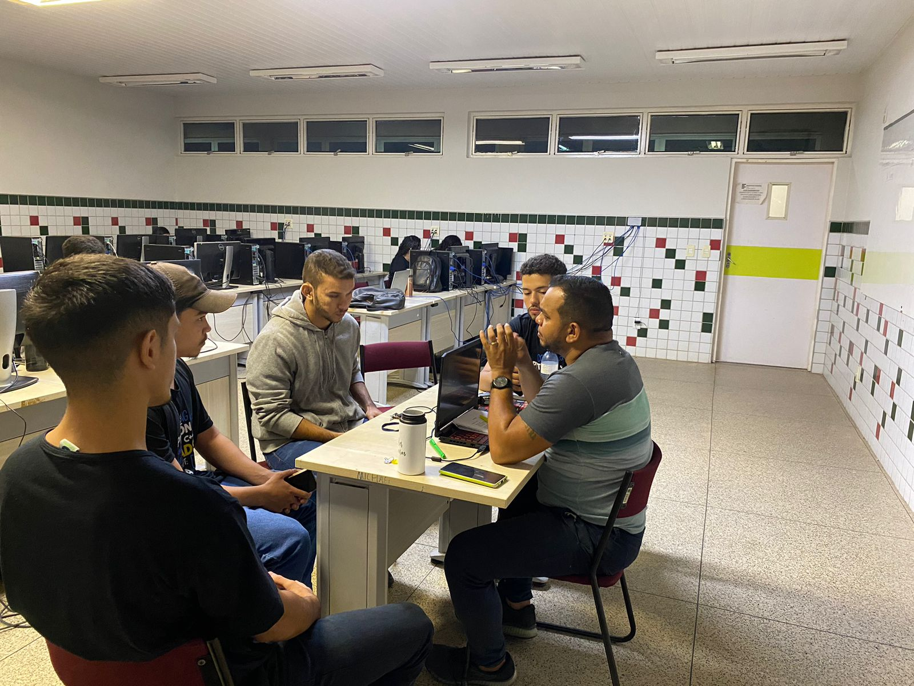

# Anexos

| 1ª Ata de Reunião - Assunto abordado |Integrantes| Frequência | Data | Como ocorreu? | Resultados |
| -----------------------    | ------  | -----------|-----------|-----------|-----------|
| Em nossa primeira reunião foram tratados assuntos como nome do projeto, logo do projeto e as funções de cada participante do projeto. | Marcos Uchôa  Diego Pereira  Nícolas Teixeira  Edberto Nascimento  |  Presente Presente Presente Presente  |03/09/2023|A reunião ocorreu por meio de mensagens, no aplicativo "WhatsApp". Cada participante sugerio um nome e uma logo para escolhermos por meio de votação.  |Com o resultado da votação, como poddemos ver na imagem ao lado, ficou decidido que o nome e a logo seriam Educa P2. Já a parte cargos, foi decidido por meio de um senso comum, visando explorar as habilidades de cada um.|

| 2ª Ata de Reunião - Assunto abordado |Integrantes| Frequência | Data | Como ocorreu? | Resultados |
| -----------------------    | ------  | -----------|-----------|-----------|-----------|
| Em nossa segunda reunião foi tratado o assunto de levantamentos de requisítos funcionais e não funcionais. | Marcos Uchôa  Diego Pereira  Nícolas Teixeira  Edberto Nascimento  |  Presente Presente Presente Presente  |18/09/2023|A reunião ocorreu de forma presencial, no IFPI - Campus Pedro II, e foi utilizado o método de entrevista com o requisitante do projeto, foram feitos diversos questionamentos a respeito do projeto que estava sendo solicitado.  |Ao decorrer da troca de perguntas e respostas, ficou bem claro o que o requisitante queria no seu projeto. Como consideração final, foram extraídos os requisitos funcionais e não funcionais do projeto que está sendo desenvolvido.|

- Não houve cronogramas significativos para a realização do projeto.