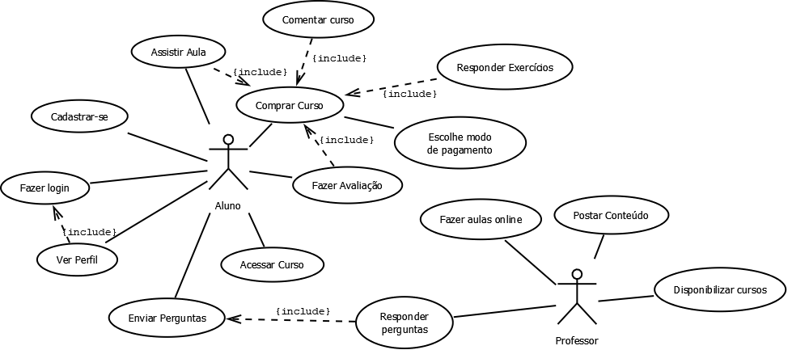
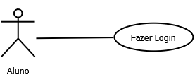
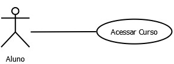
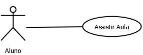
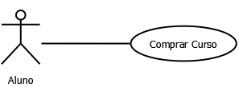

# Diagrama de Caso de Uso

- **Seleção de Casos de Uso:** Liste os Diagramas de Casos de Uso que são considerados arquiteturalmente significativos para o sistema (No mínimo 5).  

- **Critérios de Seleção:** Explique os critérios que levaram à seleção desses casos de uso.
	- **Importância: Os casos de usos listados tem uma grande importância na estrutura para o uso devido site.**
	- **Complexidade: Cada caso de uso tem sua complexidade dentro do diagrama, fazendo com que cada tenha uma função a ser seguida dentro do diagrama.**

- **Descrição de Casos de Uso:** Forneça uma breve descrição de cada caso de uso, destacando sua importância arquitetural.
	- **Cadastra-se:** Permite que o aluno se cadastre para receber informações do site, e novos cursos cadastrados, Além de poder acessar os cursos, avaliações e  valores de cada curso. 
	- **Fazer Login:** Permite que os alunos loguem no site para se tornar aluno, e ter acesso a para a compra dos cursos, visualização de aulas e avalições.  
	- **Acessar Curso:** Permite que o aluno possa acessar os cursos para assistir aula, fazer avaliações e comprar o curso. 
	- **Assistir Aula:** Permite que o aluno possa assistir a vídeo aula, que será o conteúdo do capitulo do curso. 
	- **Comprar Curso:** Permite que o aluno compre cursos, a forma de pagamento é boletos, pix, cartões de créditos de todas as bandeiras. 

- **Pontos Complexos da Arquitetura:** Identifique quais pontos complexos e específicos da arquitetura são enfatizados ou ilustrados por cada caso de uso.

# Cenários
- **Crie o Cenário:** Crie o cenário completo de ao menos 5 casos de uso.

|Nome do Caso de Uso | Cadastrar-se |
| -------------------| ------------------ |
|Finalidade/Objetivo |Permite que o aluno se cadastre para receber informações do site, e novos cursos cadastrados, Além de poder acessar os cursos, avaliações e  valores de cada curso.|
|Ator Principal    |    Aluno     |
|Pré-Condições     |   Os dados do cliente devem ser inseridos confome solicitado  |
|Fluxo Principal   | 1. Aluno escolhe a opção de se cadastrar; 2. Aluno confirma o cadastro no email; [A1]. 3. Caso de Uso encerrado;|
|Fluxo Alternativo | A1. Aluno deseja cancelar operação;  - Aluno não confirma o cadastro;  - O sistema volta para o passo 1 Fluxo principal;|

|Nome do Caso de Uso | Fazer Login |
| -------------------| ------------------ |
|Finalidade/Objetivo |Permite que os alunos loguem no site para se tornar aluno, e ter acesso a para a compra dos cursos, visualização de aulas e avaliações.|
|Ator Principal    |    Aluno     |
|Pré-Condições     |   O aluno deve está cadastrado no site  |
|Fluxo Principal   | 1. Aluno escolhe a opção de logar; 2.Preenche formulário com os dados necessários; [A1], [A2]. 3. Confirma os dados; [A1], [E1]. 4. Caso de Uso encerrado;|
|Fluxo Alternativo | A1. Deseja cancelar operação;  - Aluno não confirma os dados para login;  - Aluno volta para a página inicial;  A2. Deseja alterar algum dado do formulário;  - Aluno altera dados de algum campo para login;  - O sistema retorna no passo 2 Fluxo principal; |
|Fluxo de Exceção | E1. Os dados estão incorretos;  - Sistema mostra mensagem de algum campo incorreto;  - O sistema volta para o passo 2 Fluxo Principal;|

|Nome do Caso de Uso | Acessar Curso |
| -------------------| ------------------ |
|Finalidade/Objetivo |Permite que o aluno possa acessar os cursos para assistir aula, fazer avaliações e comprar o curso.|
|Ator Principal    |    Aluno     |
|Pré-Condições     |   O aluno deve está logado no site  |
|Fluxo Principal   | 1.Aluno clica na aba “Cursos”;   2. Aluno seleciona qual curso deseja acessar; [A1].  3. Caso de Uso encerrado;|
|Fluxo Alternativo | A1. Deseja cancelar operação; - Aluno volta para a página inicial; |

|Nome do Caso de Uso | Assistir Aulas |
| -------------------| ------------------ |
|Finalidade/Objetivo |Permite que o aluno possa assistir a vídeo aula, que será o conteúdo do capitulo do curso.|
|Ator Principal    |    Aluno     |
|Pré-Condições     |   O aluno deve está logado no site  |
|Fluxo Principal   |1. Aluno escolhe a opção de curso; [A2], [A3].  2. Aluno seleciona o capítulo; [A1]. 3. Aluno reproduz vídeo; [A4]. 4. Caso de Uso encerrado;|
|Fluxo Alternativo | A1. Aluno deseja fazer exercícios do capítulo; - Aluno clica “Responder exercícios”;  - Aluno seleciona alternativa;  - Aluno confirma a resposta;  - O sistema volta para o passo 2 Fluxo principal; A2. Aluno deseja realizar avaliação do Curso;  - Aluno clica “Fazer Avaliação”;  - Aluno responde as questões da avaliação; - Aluno confirma as respostas;  - O sistema volta para o passo 1 Fluxo principal;  A3. Aluno deseja comentar Curso; - Aluno clica “comentar curso”; - Aluno preenche um pequeno texto; - Aluno confirma o comentário; - O sistema volta para o passo 1 Fluxo principal; A4. Aluno deseja cancelar operação; - Aluno volta ao painel do curso; - O sistema volta para passo Fluxo 1 principal; |

|Nome do Caso de Uso | Comprar Curso |
| -------------------| ------------------ |
|Finalidade/Objetivo |Permite que o aluno compre cursos, a forma de pagamento é boletos, pix, cartões de créditos de todas as bandeiras.|
|Ator Principal    |    Aluno     |
|Pré-Condições     |   O aluno deve está logado no site  |
|Fluxo Principal   | 1. Aluno clica “comprar curso”; 2. Aluno seleciona os cursos que deseja comprar;[A1]. 3. Aluno escolhe a forma de pagamento. [A1], [A2]. 4. Aluno confirma os cursos selecionados; [A1]. 5. Aluno preenche o formulário com seus dados; [A1]. 6. Aluno confirma os dados; [A1], [E1]. 7. Caso de Uso encerrado;|
|Fluxo Alternativo | A1. Deseja cancelar a compra;  - O aluno fecha a operação de compra;  - O sistema volta para o passo 1 Fluxo Principal; A2. Deseja remover ou adicionar algum curso do carrinho de compras;  - O aluno remove ou adiciona os itens de compra; - O sistema volta para o passo 2 Fluxo principal;|
|Fluxo de Exceção | E1. Os dados informados do cartão estão incorretos; - Sistema mostra mensagem de erro de validação do cartão;  - Sistema volta para o passo 5 Fluxo Principal;|
