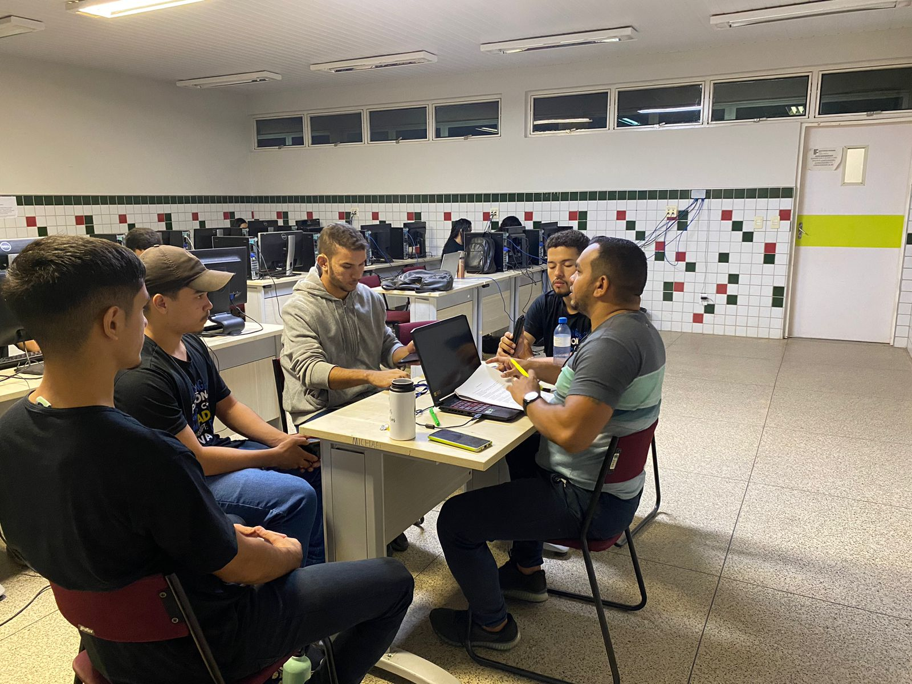

# Identificação do Projeto

|Projeto | Requisitante | Gerente de Projetos|
| -------| ------------ | -------------------|
|Educa P2| Cléber Araújo|  Marcos Uchôa      |

# Brainstorming 
- Abaixo temos imagens de todas as reuniões do grupo, incluindo uma gama de informações sobre o projeto.

| 1° - Reunião  Definições|Integrantes| Frequência | Data | Imagens | Feedback |
| -----------------------    | ------  | -----------|-----------|-----------|-----------|
|- Cargos - Logo/Nome do Sistema   |  Marcos Uchôa Diego Pereira Nícolas Teixeira Edberto Nascimento | Presente Presente Presente Presente   |   03/09/2023    |         |   => Cada integrante decide um nome e uma logo para o sistema;  => **Funções de cada integrante no 1° momento:**  --> Arquiteto de Software: (Marcos);  -->Desenvolvedor Sênio: (Diego e Nícolas);  --> Analista de Requisitos: (Edberto);  --> Gerente de Qualidade: (Edberto). | 

| 2° - Reunião  Definições|Integrantes| Frequência | Data | Imagens | Feedback |
| ----------| ------  | -----------|-----------|-----------|-----------|
| - Levantamento  de Requisitos  |  Marcos Uchôa Diego Pereira Nícolas Teixeira Edberto Nascimento |  Presente Presente Presente Presente    |   18/09/2023    |        | No presente dia foi feita uma reunião com nosso requisitante, por meio de várias pergunta foi onde ficou explícito que ele  precisava de um sistema educacional baseado na Udemy . No decorrer da conversa conseguimos abstrair os principais  requisitos funcionais e não funcionais para o desenvolvimento do sistema de nosso requisitante.     |  

# Técnicas de Elicatação de Requisitos
- A técnica utilizada foi a de entrevista semiestruturada com o requisitante do projeto, conseguimos extrair os principais pontos que o sistema do nosso requisitante precisa em sua implementação.
# Requisitos Funcionais 
- Liste todos os requisitios funcionais identificados. 

|Código |Identificação |Classificação |Ator |Objetivo|
|------ |--------------|--------------|-----|--------|
|[RF01] |Realizar cadastros de usuários  |Importante    |Usuário| O site deve permitir que os usuários se cadastrem com informações  pessoais e criem perfis.|
|[RF02] |Gestão de Conteúdos  |Importante    |Usuário| O site deve permitir que os professores adicionem, editem e removam  cursos, aulas e recursos educacionais.|
|[RF03] |Sistema de Busca  |Importante    | Sistema| O site deve possuir um mecanismo de busca eficiente para os usuários  encontrarem cursos e conteúdo relevante.|
|[RF04] |Assinaturas e Pagamentos  |Importante    | Sistema| O site deve ter uma integração de um sistema de pagamento para aquisição  de cursos, com opções de assinatura ou compra individual.|
|[RF05] |Aulas Online  |Importante    | Sistema| O site deve oferecer uma plataforma para a realização de aulas ao vivo ou  gravadas, incluindo interação entre instrutores e alunos.|
|[RF06] |Acompanhamento do Progresso  |Importante    |Usuário| O site deve permitir que os alunos acompanhem seu progresso, marquem a  conclusão de aulas e acessem relatórios de desempenho.|
|[RF07] |Fóruns e Comunidades  |Importante    |Usuário| O site deve possibilitar a criação de fóruns de discussão e comunidades  para os alunos interagirem e trocarem informações.|
|[RF08] |Feedbacks e Avaliações  |Importante    |Usuário| O site deve permitir que os professores forneçam cursos e avaliações dos  cursos aos alunos e os alunos forneçam feedback para cursos e professores.|
|[RF09] |Certificados  |Importante    |Usuário| O site deve gerar certificados de conclusão automaticamente para os  alunos que concluíram com êxito os cursos.|
|[RF10] |Suporte Multilíngue  |Importante    |Usuário| O site deve Oferecer suporte para vários idiomas, permitindo que os alunos  escolham seu idioma preferido.|
|[RF11] |Integração de Mídia  |Importante    | Sistema|O site deve suportar a incorporação de vídeos, áudio e outros tipos de  mídia nas aulas.|
|[RF12] |Notificações  |Importante    | Sistema|O site deve enviar notificações por e-mail ou por meio de mensagens  internas para informar os alunos sobre novos cursos, atualizações ou  eventos.|
|[RF13] |Sistema de Recomendação  |Importante    | Sistema|O site deve possuir um sistema de recomendação baseado no histórico de  navegação e preferências dos alunos.|
|[RF14] |Fórum de Discussão por Curso  |Importante    |Usuário|O site deve possibilitar a criação de fóruns de discussão específicos para  cada curso, permitindo que os alunos interajam e tirem dúvidas  relacionadas ao conteúdo.|
|[RF15] |Calendário de Eventos  |Importante    |Usuário|O site deve disponibilizar um calendário que mostre datas importantes,  como prazos de entrega de trabalhos, datas de exames e eventos  acadêmicos.|
|[RF16] |Acompanhamento de Atividades  |Importante    |Usuário|O site deve permitir que os professores monitorem o progresso dos alunos  em tempo real durante as aulas ao vivo, e os aluno vejam o próprio progresso durante o curso.|
|[RF17] | Integração com Redes Sociais  |Importante    |Usuário|O site deve permitir que os alunos compartilhem seu progresso,  certificados e conquistas nas redes sociais diretamente, a partir do site.|
|[RF18] |Gerenciamento dos Professores  |Importante    |Usuário|O site deve possuir painel de controle para instrutores onde eles podem  gerenciar suas aulas, comunicar-se com alunos e avaliar o desempenho dos  alunos.|
|[RF19] |Sistema de Notas  |Importante    |Usuário|O site deve possuir um sistema de notas que permita que os professores atribuam notas aos alunos e que os alunos vejam suas notas.|
|[RF20] |Sala de Chat Ao Vivo  |Importante    |Usuário|O site deve oferecer salas de chat ao vivo para dúvidas rápidas dos alunos.|
|[RF21] |Apoio a Diferentes Formatos de Arquivo  |Importante    |Usuário|O site deve aceitar e exibir diversos formatos de arquivo, como PDF, Word e  PowerPoint, para recursos de aprendizado.|
|[RF22] |Sistema de Suporte  |Importante    |Usuário|O site deve possuir um sistema de suporte com chat ao vivo, e-mail ou  telefone para ajudar os alunos com problemas técnicos.|

# Requisitos Não Funcionais 
- Liste todos os requisitios não-funcionais identificados.

|Código |Identificação |Classificação |Ator |Objetivo|
|------ |--------------|--------------|-----|--------|
|[RNF01] |Segurança |Importante    |Sistema| Garantir a segurança dos dados dos usuários, incluindo informações pessoais e  dados de pagamento.|
|[RNF02] |Desempenho |Importante    |Sistema| O site deve ser responsivo e carregar rapidamente, mesmo em conexões de  internet mais lentas.|
|[RNF03] |Escalabilidade |Importante    |Sistema| Deve ser capaz de lidar com um aumento no número de usuários e conteúdo  sem degradação significativa do desempenho.|
|[RNF04] |Conformidade com Acessibilidade |Importante    |Sistema| Garantir que o site seja acessível para pessoas com deficiências, seguindo diretrizes  como o WCAG.|
|[RNF05] |Disponibilidade |Importante    |Sistema| Manter o site disponível 24/7, com tempo de inatividade mínimo para manutenção.|
|[RNF06] |Usabilidade  |Importante    |Sistema| Garantir que o site seja intuitivo e fácil de usar, com um design amigável ao usuário.|
|[RNF07] |Privacidade de Dados |Importante    |Sistema| Garantir a conformidade com regulamentos de privacidade, como a LGPD, para  proteger os dados pessoais dos usuários.|
|[RNF08] |Segurança contra Ataques |Importante    |Sistema| Implementar medidas de segurança contra ataques cibernéticos, como firewall,  detecção de intrusões e criptografia.|
|[RNF09] | Desempenho em Dispositivos Móveis |Importante    |Sistema| Garantir que o site seja responsivo e funcione bem em dispositivos móveis, como  smartphones e tablets.|
|[RNF10] |Conformidade com Padrões Web |Importante    |Sistema| Garantir que o site siga os padrões web atuais, como HTML5 e CSS3, para  compatibilidade e acessibilidade.|
|[RNF11] |Tolerância a Falhas |Importante    |Sistema| Desenvolver o site de forma a ser resiliente a falhas de servidor ou conexão de rede.|
|[RNF12] | Métricas e Análises |Importante    |Sistema| Incluir ferramentas para coleta de métricas de uso e análise do comportamento dos  usuários para melhorar a experiência.|
|[RNF13] |Latência de Rede |Importante    |Usuário| Garantir que o site seja otimizado para baixa latência de rede, especialmente durante  a transmissão de aulas ao vivo.|
|[RNF14] |Controle de Acesso |Importante    | Sistema| Implementar controle rigoroso de acesso, garantindo que apenas usuários  autorizados possam acessar conteúdo sensível.|
|[RNF15] |Compatibilidade com Navegadores e Dispositivos |Importante    |Usuário| Certificar-se de que o site funcione corretamente em uma variedade de navegadores  (Chrome, Firefox, Safari, Edge) e dispositivos (desktop, tablets, smartphones).|
|[RNF16] |Redimensionamento Automático de Vídeos |Importante    |Usuário| Os vídeos devem ser automaticamente redimensionados e transmitidos em  resoluções adequadas à largura de banda do usuário para evitar buffering excessivo.|
|[RNF17] |Criptografia de Ponta a Ponta |Importante    |Usuário| Usar criptografia de ponta a ponta para proteger a comunicação entre os Sistemas e  o servidor, garantindo a segurança dos dados.|
|[RNF18] |Resposta a Carga |Importante    |Sistema|Certificar-se de que o site possa lidar com picos de tráfego, como durante inscrições  em cursos populares, sem queda de desempenho.|
|[RNF19] |Política de Privacidade Transparente |Importante    |Sistema| Fornecer uma política de privacidade clara e transparente para os usuários,  explicando como os dados são coletados e usados.|
|[RNF20] |Monitoramento de Segurança Contínuo |Importante    |Usuário| Estabelecer um sistema de monitoramento de segurança para identificar e responder  rapidamente a possíveis ameaças.|
|[RNF21] |Backups Automatizados |Importante    |Usuário| Realizar backups automáticos frequentes de dados e configurações para evitar perda  de informações críticas.|
|[RNF22] |Documentação Adequada |Importante    |Usuário| Manter documentação técnica completa e atualizada para facilitar a manutenção e a  solução de problemas.|
|[RNF23] |Migração de Dados |Importante    |Usuário| Ter um plano de migração de dados eficiente ao atualizar o sistema ou fazer grandes  mudanças na infraestrutura.__|
