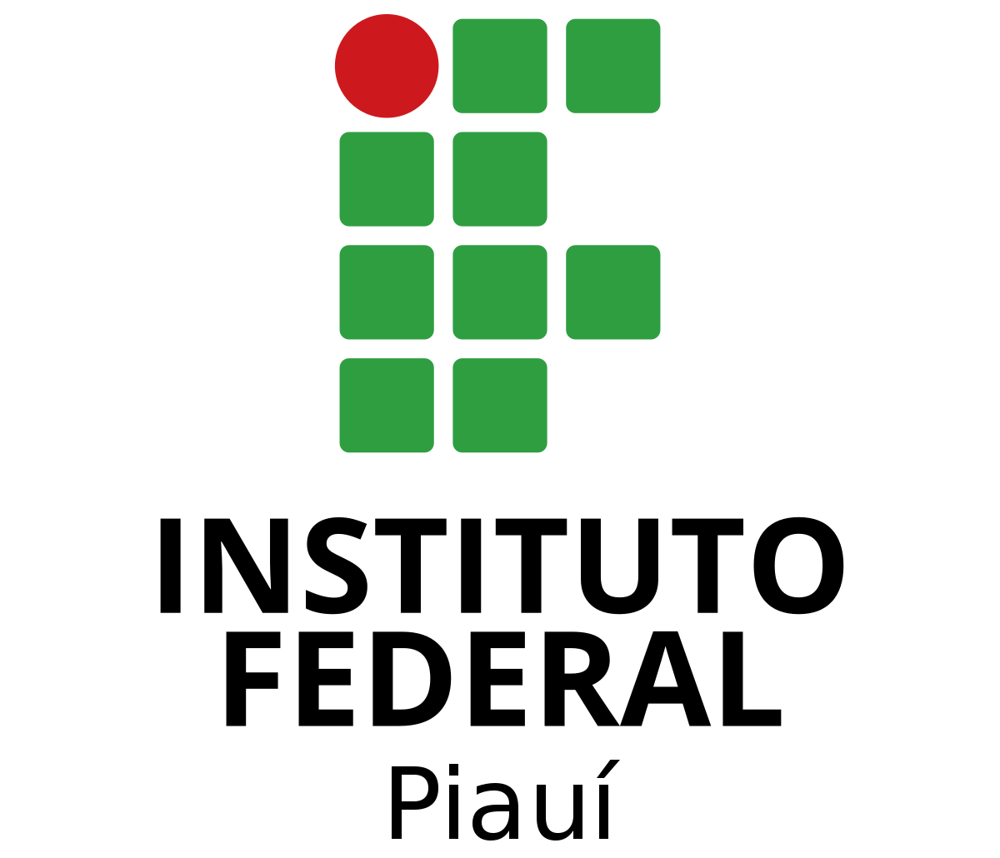

# Sobre

Este repositório é destinado ao grupo x - [**gXchange**](Link do repositório do Github), contém toda a documentação do   projeto da disciplina **Engenharia de Software III - Arquitetura e Design de Software**, ministrada pela Professor **Cleber Araujo**, no **Instituto Federal do Piaui Campus Pedro II, durante o período de 2023/2**.

<br />

# Nome da Empresa de Desenvolvimento 
- Falar brevemente sobre a Empresa e a equipe de desenvolvimento. 

# Contribuidores

|Foto | Matrícula | Nome | GitHub | E-mail|
|:--:|:--:|:--:|:--:|:--:|
|| 20211p2ads0320 | Diego Pereira | [Diego Pereira](https://github.com/Diegop33p2)|caped.20211p2ads0320@aluno.ifpi.edu.br|
|| 2022123tads0373 | Nícolas Teixeira Barros| [Nicolas Teixeira Barros](https://github.com/nicolas777711) |caped.202123tads0373@aluno.ifpi.edu.br|
|| 5748559 | Marcos | [Marcos](https://github.com/fabricio) |marcos@outlook.com|
|| 5748559 | Edberto | [Edberto](https://github.com/fabricio) |edberto@outlook.com|

# Histórico de Revisões
|Versão | Data | Descrição | Autor | 
|-----|-----------|------|--------|
| 1.0  | 30/09/2023 | Adicionado Tela de Login| Nícolas Teixeira |
| 1.1  | 01/10/2023 | Adicionado Cadastro| Diego Pereira |
| 1.2  | 02/10/2023 | Adicionado Cursos| Nícolas Teixeira |
| 1.3  | 05/10/2023 | Adicionado Blog| Diego Pereira |
| 1.4  | 06/10/2023 | Adicionado Comprar Cursos | Nícolas Teixeira |
| 1.5  | 08/10/2023 | Adicionado Tela do Profesor | Diego Pereira |
| 1.6  | 10/10/2023 | Adicionado Aulas | Nícolas Teixeira |
| 1.7  | 13/10/2023 | Adicionado Certificado | Diego Pereira |
| 1.8  | 14/10/2023 | Adicionado Avaliação | Nícolas Teixeira |
| 1.9  | 15/10/2023 | Adicionado Conta Profesor | Diego Pereira |

# Como usar algumas funções: 

# Documentação de Software

**Negrito**
*Italico* 

1. Primeiro
2. Segundo
3. Terceiro  

-[x]Tomar Banho  
-[ ]Comer Cuscuz  
-[ ]Limpar casa 

|Nome |Idade|
|-----|-----|
|Eduardo|28| 
|Odineia|26|
|Abdenaide|22|

~~Tachado~~

```
    # coding: utf-8

    def soma(a, b):
        if isinstance(a, basestring) or isinstance(b, basestring):
            raise ValueError(u'Somente números são permitidos')
        return a + b
```

Emoji - :snake: :heart::rocket:

> "Essa é uma citação"

* Item 1
* Item 2

`def soma(a, b):
    if isinstance(a, basestring) or isinstance(b, basestring):
        raise ValueError(u'Somente números são permitidos')
    return a + b`

[Portal P2](https://www.portalp2.com)

For full documentation visit [mkdocs.org](https://www.mkdocs.org).


* `mkdocs new [dir-name]` - Create a new project.
* `mkdocs serve` - Start the live-reloading docs server.
* `mkdocs build` - Build the documentation site.
* `mkdocs -h` - Print help message and exit.

    mkdocs.yml    # The configuration file.
    docs/
        index.md  # The documentation homepage.
        ...       # Other markdown pages, images and other files.
