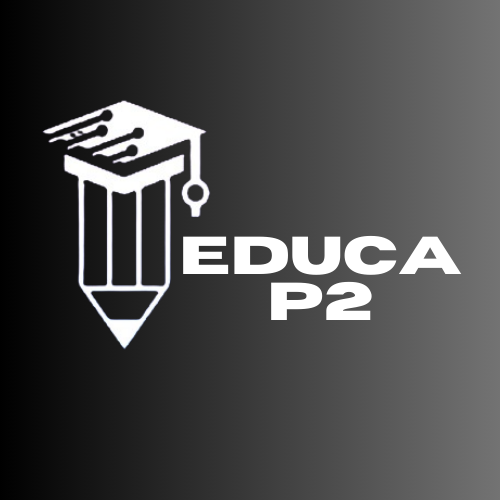

# Sobre

Este repositório é destinado ao grupo x - [**DEVtrom**](https://github.com/marcosbu/Trabalho-de-arquitetura.git), contém toda a documentação do projeto da disciplina **Engenharia de Software III - Arquitetura e Design de Software**, ministrada pela Professor **Cleber Araujo**, no **Instituto Federal do Piaui Campus Pedro II, durante o período de 2023/2**.

 

# DEVtrom
- Buscando passar educação por meio da tecnologia.  
- O Educa P2 é um site que de inicio foi pensdo de forma regional, mas que futuranmente pretende expandir suas áreas sem fronteiras.
- Somos a DEVtrom, uma equipe iniciante no campo do desenvolvimento, mas que busca ser reconhecida por meio de muito esforço para satisfazer a sua demanda, nosso querido cliente.

# Contribuidores

|Foto | Matrícula | Nome | GitHub | E-mail|
|:--:|:--:|:--:|:--:|:--:|
|| 20211p2ads0320 | Diego Pereira | [Diego Pereira](https://github.com/Diegop33p2)|caped.20211p2ads0320@aluno.ifpi.edu.br|
|| 5748559 | Nicolas | [Nicolas](https://github.com/fabricio) |nicolas@outlook.com|
|| 2022123tads0101 | Marcos Uchôa | [Marcos Uchôa](https://github.com/marcosbu) |caped.2022123tads0101@aluno.ifpi.edu.br|
|| 5748559 | Edberto | [Edberto](https://github.com/fabricio) |edberto@outlook.com|

# Histórico de Revisões
|Versão | Data | Descrição | Autor | 
|-----|-----------|------|--------|
| 1.0  | 01/10/2023 | Adicionado Tela de Login| Cleber Araujo |