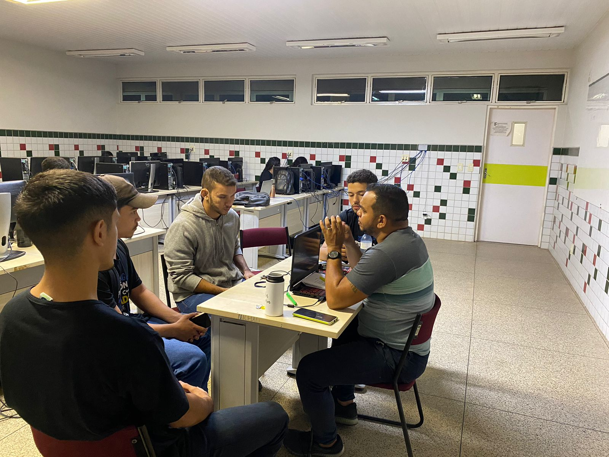

# Metodologia e Práticas de Desenvolvimento

## Metodologia de Software
- **Origem da Metodologia:**  
A metodologia de desenvolvimento que foi utilizada foi a RAD(Desenvolvimento Rápido de Aplicações), ela é uma abordagem de desenvolvimento de software que coloca ênfase na entrega rápida de protótipos e iterações.  
- **Razões para a Metodologia:**  
A RAD foi escolhida por ter uma prototipação rápida, pois ela envolve a criação rápida de protótipos para fornecer uma representação visual e funcional das características-chave do sistema. Por possuir reutilização de componentes que promove a reutilização de componentes existentes para acelerar o desenvolvimento. E por ela ter uma ênfase na entrega rápida, por isso a nossa equipe escolheu essa metolodia, visando a entrega rápida com eficiencia e eficacia.  

   

   

## Organização da Equipe
- **Arquiteto:** Marcos;
- **Analista de Qualidade e Engenheiro de Requisitos:** Edberto;
- **Desenvolvedores:** Diego e Nicolas.

## Reuniões

- **Ferramentas de Comunicação:**
As ferranmentas utilizadas foram:
- Google Met
- Whatsapp

## Outras Considerações
- Sem mais considerações.

